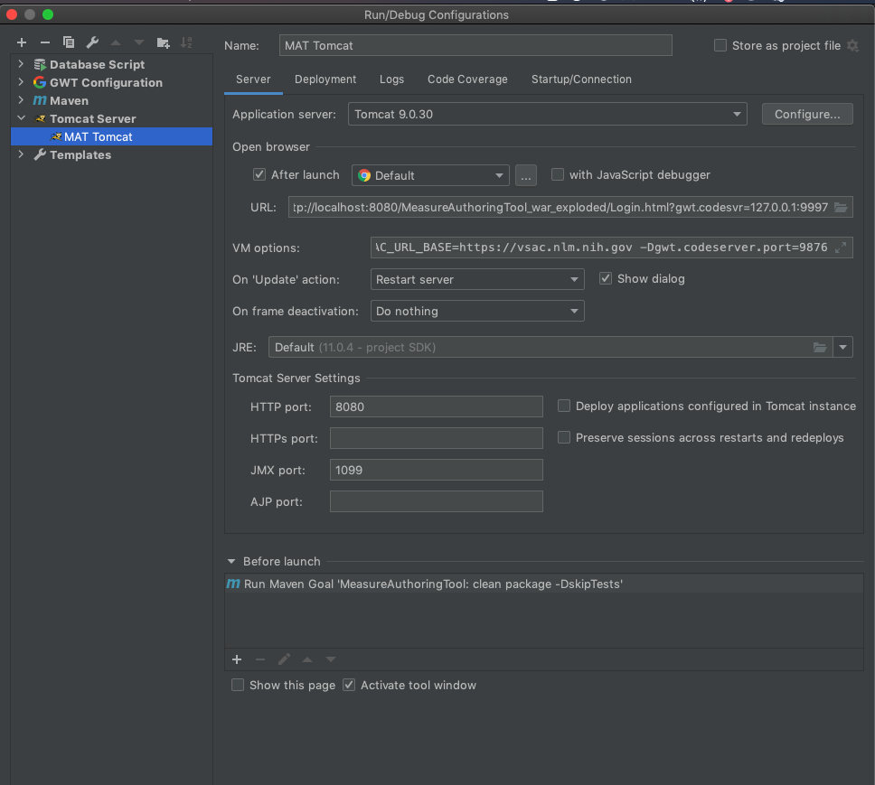
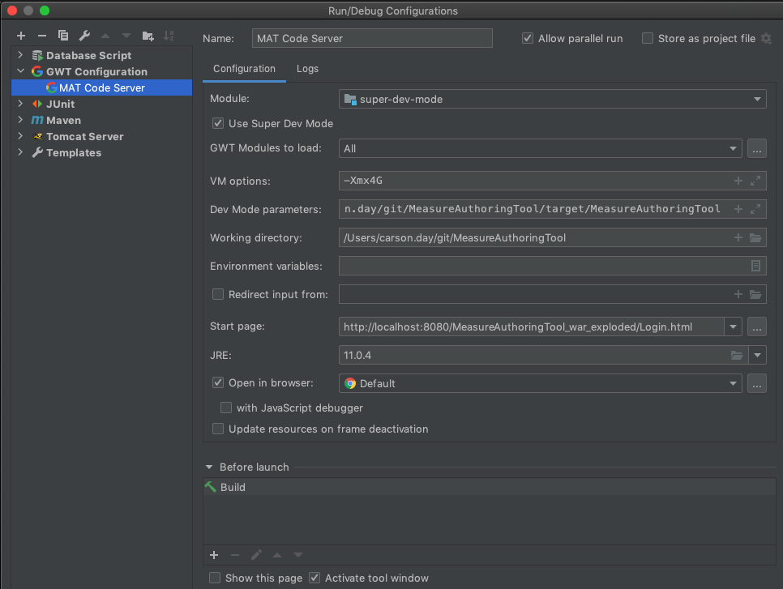

# Measure Authoring Tool (MAT)

## Installation
The Measure Authoring Tool (MAT) was designed using many open source products including, the Google Web Toolkit (GWT) 
framework, Java JDK, MySQL, and Eclipse. GWT allows a developer to write client side code in Java and GWT converts 
it to JavaScript. The MAT uses MySQL as its backend database server, and the IDE is Eclipse/Intellij for Java EE Developers.

Due to the use of these open source products, a working knowledge of Java development and some research into how 
the products work with each other in your environment may be necessary. Research from discussions on product forums, 
help documents, internet searches and knowledge of the local environment where the MAT will be running may all need to 
be checked if there are errors during the install.

### Configure Java (JDK)
*   The application has not been tested with version above Java 1.11; (OPEN JDK is fine) please ensure this version is in the environment.
*   Verify that `JAVA_HOME` and `PATH` system variables are pointing to the proper folder(s).
*   For example, in a Windows environment, the `JAVA_HOME` (Environment Variables under Advanced System Settings (should point to the Java SDK 1.11.x folder and `PATH` should point to the Java 1.11.x/bin).

### Configure Maven
You should install the latest Maven locally.

Windows:
*   [Install and Configure Maven (3.6.3+)](https://maven.apache.org/install.html)

OSX: 
*   `brew install maven` or if already installed  `brew update maven`


### Create MAT Database
Currently in production MAT uses MySQL Community Version 5.7.
[Here](https://gist.github.com/operatino/392614486ce4421063b9dece4dfe6c21) are some instructions for installing it using brew.

I prefer using MySQL Community Version 8.0+. The app works with this but I just use it locally. It also requires
you to change a pom.xml dependency for the new driver. You have to be careful and not check this in with commits.
Here are the instructions for installing it:
*   Install MySQL (MAT currently has been tested with MySQL Community Version 8.0+) available from [MySQL] (https://dev.mysql.com/downloads/mysql/)
*   Run the MySQL community server installer for your operating system and the MySQL workbench (which comes with the download).
*   Enter a passowrd and click on Use Legacy Password Encryption. (Remember the username/pwd you will need these in future steps.)
*   For Mac:
    *   Go to System Preferences/ MY SQL after installing.
    *   Click Initialize Database.
    *   Start the MYSQL Db.
*   Create a new MySQL Connection to the database. I use jetbrains [datagrip](https://www.jetbrains.com/datagrip/)
*   If you have access to a data dump, create a schema and load it with your dump script.
*   If you do not you can load the dump script located in scripts. 
*   From the MAT Code base, find the `scripts/Dump*.sql` file and then execute the script in the database that was just created. <br> **(Note this script is from a dump and drops and create a schema called  `MAT_APP_BLANK`)**
*   There are other more recent dump files located [here](https://drive.google.com/drive/u/0/folders/1x0WhhIM9WIwCzXtmm46iF6wjXeVui5ct). 

### Tomcat installation

[Download tomcat 9](https://tomcat.apache.org/download-90.cgi)
*   After installing in OSX i did a `sudo chmod -R 777` on the tomcat directory.

Add the Resource to the /apache-tomcat-9.X.X/conf/context.xml file. Match the userName and password to match your mysql 
configuration.

```text
<Resource name="jdbc/mat_app_tomcat"
         cachingAllowed="true"
         cacheMaxSize="1000000"
         auth="Container"
         type="javax.sql.DataSource"
         factory="org.apache.tomcat.jdbc.pool.DataSourceFactory"
         testWhileIdle="true"
         testOnBorrow="true"
         testOnReturn="false"
         validationQuery="SELECT 1"
         validationInterval="30000"
         timeBetweenEvictionRunsMillis="30000"
         maxActive="100"
         minIdle="10"
         maxWait="10000"
         initialSize="10"
         removeAbandonedTimeout="60"
         removeAbandoned="true"
         logAbandoned="true"
         minEvictableIdleTimeMillis="30000"
         jmxEnabled="true"
         jdbcInterceptors="org.apache.tomcat.jdbc.pool.interceptor.ConnectionState;
           org.apache.tomcat.jdbc.pool.interceptor.StatementFinalizer"
         username="mat"
         password="mat"
         driverClassName="com.mysql.jdbc.Driver"
         url="jdbc:mysql://localhost:3306/MAT_APP_BLANK"/>
```

Copy mysql jdbc to tomcat lib directory.
```bash cp ~/.m2/repository/mysql/mysql-connector-java/5.1.6/mysql-connector-java-5.1.6.jar /apache-tomcat-9.X.X/lib```

### Create an OKTA account to use locally. 
You need to setup an OKTA dev account to run locally. This is a stand-in for HARP.
After creating one and going to settings my url looks like this: 
```text 
https://dev-980994-admin.okta.com/admin/settings/account
```
The ```dev-980994``` part is what you will use to confiugre okta below.

If you started from a blank ID you can run this to update your user row with your okta id:
```sql
update USER set HARP_ID = '${YOUR_OKTA_ID:john-doe}' where LOGIN_ID='devUser8762';
```
If you started from a db dump you will need to overwrite a HARP_ID in the user table with your HARP_ID to login.

### Setup microservices needed for MAT
Follow the instructions here: https://github.com/MeasureAuthoringTool/QDM-QICore-Conversion 

### Setup local environment intellij configurations (mvn, tomcat, super dev mode) ###
GWT takes a while to compile so if you setup like this locally you will save a lot of time. These instructions
are written for intellij.

- Install the GWT intellij plugin.
- Go to Edit Configurations 
- Click the + in the top left and add a tomcat server. 
- Here is how I have mine setup. 
  - Remove build and add in mvn command:
  ```text
  clean package -DskipTests
   ```
  - Paste in the following for VM options: Replace https://dev-980994.okta.com with your okta user you created above.
 ```text
-DENVIRONMENT=DEV
-Dlog4j.ignoreTCL=true
-D2FA_AUTH_CLASS=mat.server.twofactorauth.DefaultOTPValidatorForUser
-D2FA_AUTH_CLASS1=mat.server.twofactorauth.DefaultOTPValidatorForUser
-DBONNIE_RESPONSE_TYPE=code
-DBONNIE_REDIRECT_URI=https//yourredirectURI.com
-DBONNIE_CLIENT_ID=1234567890
-DBONNIE_CLIENT_SECRET=1234567890
-DBONNIE_URI=https://bonnieURL.org
-DALGORITHM=EncyptionAlgorithm
-DPASSWORDKEY=PasswordKey
-DFHIR_SRVC_URL=http://localhost:9080
-DQDM_QICORE_MAPPING_SERVICES_URL=http://localhost:9090
-DCQL_ELM_TRANSLATION_URL=http://localhost:7070
-DHARP_BASE_URL=https://dev-980994.okta.com
-DHARP_URL=https://dev-980994.okta.com/oauth2/v1
-DHARP_CLIENT_ID=0oaaqovyrHa6XaCZS4x6
-DMAT_API_KEY=DISABLED
-DVSAC_TICKET_URL_BASE=https://utslogin.nlm.nih.gov/cas/v1
-DVSAC_URL_BASE=https://vsac.nlm.nih.gov
-Dgwt.codeserver.port=9876
 ```
- Go to Edit Configurations again and this time click the + and pick maven.
  - Here is how I setup my maven build that runs tests. 
  - Here is how I setup my maven that skips tests. 
- Go to Edit Configurations again and click the + and pick GWT Configuration.
  - Here is how I have mine setup. 
  - Remove build and add a mvn task. Command line:
  ```text
  package -P local-super-dev-mode -DskipTests
  ```
  - Dev mode params: 
  ```text
  -noserver -war /Users/carson.day/git/MeasureAuthoringTool/target/MeasureAuthoringTool
  ```
  - Start page: 
  ```text
  http://localhost:8080/MeasureAuthoringTool_war_exploded/Login.html
  ```

### How to build locally and run with super dev mode.
To compile faster you can make these changes, but *DO NOT* check them in.
- In the *gwt.xml files in MAT. Change user agent to this: 
```xml
<set-property name="user.agent" value="safari"/>
```

1. Select Mat Code Server and start it up.
3. Select Mat Tomcat and start it up.     (wait until the server starts)
4. A browser should pop up and you are off and running in super dev mode.
5. Go to http://localhost:9876/
6. Drag the Dev Mode On button onto your bookmark bar.
7. Go to the browser page that popped up. View -> Developer.
8. Click sources.
9. The java GWT code from super dev mode will show up here under source maps 
10. You set break points in the browser and debug from the js.
11. To recompile code click the bookmark you dragged to the bar in step 6 while in MAT.

#### Release build (NON-local)
 `mvn clean install`

### Log in to MAT
To login to MAT, open MySQL Workbench and run the following queries:
*   `SELECT * FROM USER where USER_ID='Admin'` 
    *   Look at the LOGIN_ID is your UserID. 
    *   The password default is ‘gargleBlaster_10’. 
    *   Enter any three digit code for security code.   
*   Navigate to the MAT log in page GUI and use the UserID and password from the previous step and log in to MAT.
*   Once logged in, navigate to the [Mat Account]() tab and enter the Admin user details under the [Personal Information]() tab and the [Security Questions]() tab to setup user’s security questions.
*   To change the password to something new, use the [Password]() tab.
*   To create users an email is sent and this must be configured to obtain user names and passwords.

### Important Security Setup With [Git Secrets](https://github.com/awslabs/git-secrets)
1.  Use brew to install git secrets `brew install git-secrets`
2.  Clone this repository (you can skip this if you've already cloned it from previous steps)
3.  Note: You may have to reinitialize these hooks each time you clone a new copy of the repo
4.  Follow these [instructions](https://github.com/awslabs/git-secrets) for setting up the pre-commit hooks:
    ```bash
    cd /path/to/MeasureAuthoringTool
    git secrets --install
    git secrets --register-aws
    ```
5.  Done! Now each commit should be automatically scanned for accidental AWS secret leaks.
