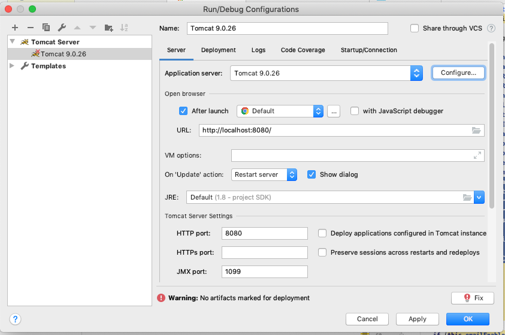

# MAT tool Intellij install instructions

[Please ensure MAT is set up correctly by following this guide](README_SB.md)

## Create MAT intellij project

From the menu select **File-> New-> Project from Existing Sources** 
and select the mat directory from the base of the mat git repository and be sure to select maven as the external model

After it is imported, do a **Build -> Rebuild Project** to ensure it is all set up correctly

You also need to do a `mvn clean install` to generate the GWT javascript,css,etc.

### Tomcat set up

From the menu select **Run-> New-> Edit Configurations** 

Click on the + in the upper left-hand corner. Select Tomcat server -> Local

You should see a dialog like this


change URL to http://localhost:8080/mat/

Click on the Fix button and select the war or the exploded directory.
The exploded directory is faster for development.

in the VM options text box, add the following and edit for your configuration.

```
-Xmx1G 
-DENVIRONMENT=DEV 
-Dlog4j.ignoreTCL=true
-DVSAC_TICKET_URL_BASE=https://utslogin.nlm.nih.gov/cas/v1
-DVSAC_URL_BASE=https://vsac.nlm.nih.gov 
-D2FA_AUTH_CLASS=mat.server.twofactorauth.DefaultOTPValidatorForUser 
-D2FA_AUTH_CLASS1=mat.server.twofactorauth.DefaultOTPValidatorForUser 
-DBONNIE_RESPONSE_TYPE=code 
-DBONNIE_REDIRECT_URI=https//yourredirectURI.com 
-DBONNIE_CLIENT_ID=1234567890 
-DBONNIE_CLIENT_SECRET=1234567890
-DBONNIE_URI=https://bonnieURL.org 
-DALGORITHM=EncyptionAlgorithm 
-DPASSWORDKEY=PasswordKey
-DFHIR_SRVC_URL=https://matdev.semanticbits.com/mat-fhir-services/
-DQDM_QICORE_MAPPING_SERVICES_URL=https://matdev.semanticbits.com/qdm-qicore-mapping-services
-DMAT_API_KEY=DISABLED
```

Now from the intellij menu, you should be able to run or debug the MAT application.


 


